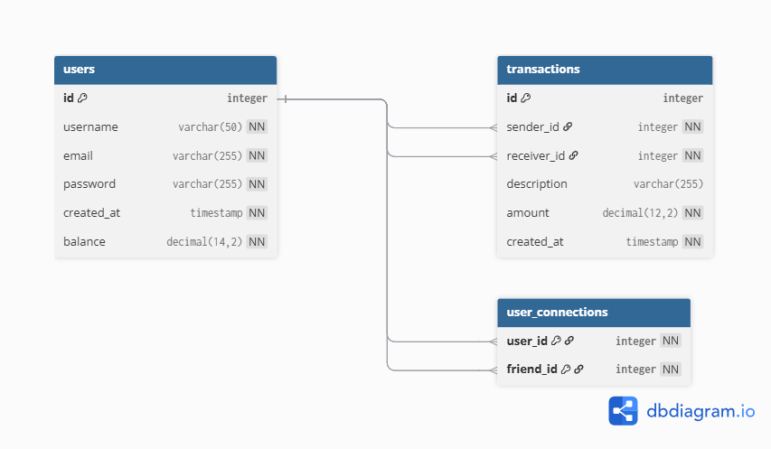

## Modèle Physique de Données


**DBML (source)**

```dbml
Table users {
  id             integer [pk, increment]
  username       varchar(50)  [not null, unique]
  email          varchar(255) [not null, unique]
  password  varchar(255) [not null]
  created_at     timestamp    [not null, default: `CURRENT_TIMESTAMP`]
  balance        decimal(14,2) [not null, default: 0]
}

Table transactions {
  id           integer [pk, increment]
  sender_id    integer [not null, ref: > users.id]
  receiver_id  integer [not null, ref: > users.id]
  description  varchar(255)
  amount       decimal(12,2) [not null]
  created_at   timestamp [not null, default: `CURRENT_TIMESTAMP`]
}

Table user_connections {
  user_id   integer [not null, ref: > users.id]
  friend_id integer [not null, ref: > users.id]

  indexes {
    (user_id, friend_id) [pk]
  }
}

